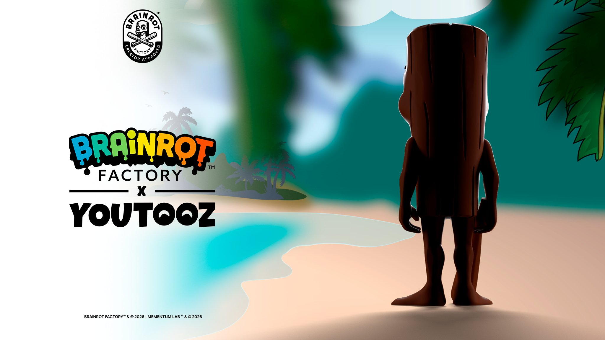

# TungTungTooz

<p align="center">
	
</p>

<p align="center">
	<strong>A Brainrot Factory × Youtooz preview site for Tung Tung Tung Sahur, also known as Triple T.</strong>
</p>

<p align="center">
	<a href="https://x.com/mementumlab/status/2086758450701168711">Reference post on X</a> ·
	<a href="#features">Features</a> ·
	<a href="#run-locally">Run locally</a> ·
	<a href="#disclaimer">Disclaimer</a>
</p>

<p align="center">
	
	
	
	
</p>

---

## What this is

TungTungTooz is a lightweight, playful, concept page by the Brainrot Factory × Youtooz vibe.

## Reference Post

> Coming soon 👀 @youtooz

Source: [Mementum Lab on X](https://x.com/mementumlab/status/2086758450701168711)

## Preview

<p align="center">
	
</p>

## Features

<table>
	<tr>
		<td valign="top" width="50%">
			<ul>
				<li>Hero section with a live countdown and teaser placeholder</li>
				<li>Interactive 3D figure viewer built with Three.js primitives</li>
				<li>Colorway switching and optional accessory toggle</li>
			</ul>
		</td>
		<td valign="top" width="50%">
			<ul>
				<li>Downloadable PNG drop card generator powered by html2canvas</li>
				<li>Responsive layout tuned for mobile and GitHub Pages deployment</li>
				<li>Clean project structure ready for future updates</li>
			</ul>
		</td>
	</tr>
</table>

## Screenshots

<p align="center">
	
</p>

<p align="center">
	<em>More in-app screenshots Soon.</em>
</p>

## Tech Stack

- Vite
- React + TypeScript
- Tailwind CSS
- @react-three/fiber + @react-three/drei
- html2canvas

## Why it stays lightweight

- The app uses a small component structure instead of a heavy framework wrapper
- The 3D viewer is made from basic primitives instead of a large model file
- The build is configured with a relative base so it can move cleanly to GitHub Pages

## Run Locally

```bash
npm install
npm run dev
```

## Build

```bash
npm run build
```

## Preview the Production Build

```bash
npm run preview
```

## Project Structure

- `src/components/Hero.tsx` for the countdown and teaser area
- `src/components/Viewer.tsx` for the low-poly 3D figure
- `src/components/CardGenerator.tsx` for the downloadable mock card
- `src/components/Footer.tsx` for the disclaimer and placeholder links
- `public/mementumlab-coming-soon.jpg` for the embedded teaser image

## Deployment Notes

The Vite config uses a relative base so the site is ready for GitHub Pages without hardcoding a repository path.

If you want to publish it, build it with `npm run build` and point GitHub Pages at the generated `dist/` output.

## Disclaimer
